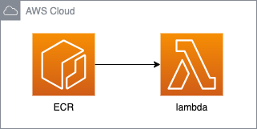
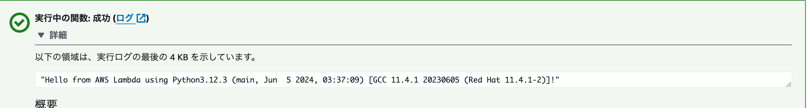

# Terraformを使ったLambda関数のコンテナイメージ構築

<p align="center">
  
</p>


# 概要

このREADMEでは、Terraformを使用してLambda関数のコンテナイメージを構築する方法について説明します。具体的には、IAM、ECR、およびLambdaを使用してインフラを構成し、効率的かつ一貫したデプロイを実現する手順を詳述します。

# 機能一覧
+ **IAMロール作成**: Lambda関数の実行に必要なIAMロールとポリシーを作成
+ **ECRリポジトリ作成**: コンテナイメージを保存するためのECRリポジトリを作成
+ **Lambda関数デプロイ**: コンテナイメージを使用してLambda関数をデプロイ

# インフラ構成
+ **IAM**: Lambda関数が必要な権限を持つためのIAMロールとポリシーを定義します
+ **ECR**: Lambda関数のコンテナイメージを保存するためのECRリポジトリを作成します
+ **Lambda**: ECRリポジトリに保存されたコンテナイメージを使用してLambda関数をデプロイします

# PythonファイルをLambdaにアップロードする場合との比較: メリットとデメリット

## メリット
    + 一貫性と依存関係の管理: コンテナイメージは依存関係や環境設定を含む一貫した実行環境を提供。
    + パフォーマンス: コンテナイメージは迅速にデプロイおよびスケール可能。
    + 柔軟性: カスタムランタイムや特定のOSライブラリが必要な場合にも対応可能。

## デメリット
    + 複雑さ: コンテナのビルドと管理が複雑。
    + ビルド時間: コンテナイメージのビルドに時間がかかることがある。
    + コスト: コンテナレジストリの使用には追加コストが発生。
    + ファイルの確認: Lambda管理画面で個別のファイルを確認できない。

# 起動とデプロイ方法

以下のコードを実行してインフラを構築します。
```
bin/terraform_apply
```

# 停止
以下のコードを実行すると停止できます。
```
bin/terraform_destroy
```

# 結果

以下のテスト結果になりました。

<p align="center">
  
</p>

<!-- # Qiita記事

技術詳細はQiitaに記載しています。 -->
